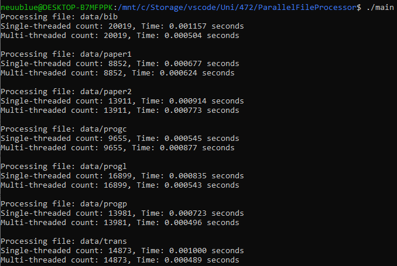

# **Parallel File Processing System: Multithreading vs. Single-threaded Execution**

## **1. Project Overview**

This project demonstrates the development of a parallel file processing system that utilizes both multithreading and single-threaded execution to count the frequency of words in text files. The primary goal is to explore and compare the performance between these two approaches. The system processes multiple large files in parallel using POSIX threads and measures performance through metrics such as execution time for each approach.

This project helps demonstrate the advantages and disadvantages of multithreading over single-threaded processing, such as execution speed, CPU utilization, and resource overhead.

---

## **2. Problem Description**

The system reads and processes a directory of text files from The Calgary Corpus. The task is to count the total words in each file and measure the time taken to perform the task using:
1. **Single-threaded Execution**: Process the entire file sequentially with a single thread.
2. **Multithreaded Execution**: Divide the file into equal-sized chunks and process each chunk in parallel using POSIX threads.

We compare the two approaches to identify:
- Performance improvements from parallelism.
- Overheads of thread management.
- Scalability with larger files.

---

## **3. Structure of the Code**

Below is a high-level **diagram of the program's structure**:



```
Parallel-File-Processor/
├── src/
│   ├── main.c            # Entry point of the program
│   ├── file_processing.c # Single-threaded implementation
│   ├── threading.c       # Multithreaded implementation
├── include/
│   ├── file_processing.h # Header for single-threaded processing
│   ├── threading.h       # Header for multithreaded processing
├── data/                 # Calgary Corpus files
└── README.md             # Instructions and project documentation
```

1. **`main.c`**: 
   - Controls program flow.
   - Calls both the single-threaded and multithreaded functions and records the execution times for comparison.

2. **`file_processing.c`**:
   - Implements the single-threaded word count function.
   - Stores the result in a global variable accessed through getter and setter functions.

3. **`threading.c`**:
   - Implements the multithreaded word counting using POSIX threads.
   - Each thread processes a chunk of the file, and the results are aggregated.

---

## **4. Process Management and Threading Implementation**

1. **Single-threaded Execution**:
   - Reads the file sequentially from start to end and counts words whenever a whitespace or newline character is encountered.

2. **Multithreaded Execution**:
   - The file is divided into 5 chunks (one per thread).
   - POSIX threads process the assigned chunks in parallel, counting words in each chunk.
   - Results from all threads are aggregated after they finish.

3. **Thread Safety and Error Handling**:
   - Pthreads are used for safe parallel execution.
   - Proper error handling ensures that threads complete correctly, and file pointers are safely managed.

---

## **5. Inter-Process Communication (IPC)**

This project incorporates inter-process communication (IPC) using pipes to enable data exchange between child processes and the parent process. Each child process processes a file and sends the word counts and execution times (for both single-threaded and multi-threaded modes) to the parent process via dedicated pipes. 

Future enhancements could explore other IPC mechanisms such as message queues or shared memory for more complex communication patterns, enabling greater scalability and efficiency in task distribution across processes.

---

## **6. Performance Evaluation**

The table below summarizes the **word counts and execution times** for both approaches.

| File Name   | Word Count | Single-threaded Time (s) | Multi-threaded Time (s) |
|-------------|------------|--------------------------|-------------------------|
| bib         | 20019      | 0.000866                 | 0.001144                |
| paper1      | 8852       | 0.000502                 | 0.000235                |
| paper2      | 13911      | 0.000712                 | 0.000234                |
| progc       | 9655       | 0.000414                 | 0.000225                |
| progl       | 16899      | 0.000651                 | 0.000231                |
| progp       | 13981      | 0.000481                 | 0.000270                |
| trans       | 14873      | 0.000750                 | 0.000245                |



---

## **7. Discussion**

### **Advantages of Multithreading**
1. **Improved Performance**: 
   - For larger files, parallel execution using multiple threads reduces the processing time compared to single-threaded execution.
2. **Better CPU Utilization**: 
   - Multiple threads allow the program to fully utilize the multi-core architecture of modern processors.
3. **Responsiveness**: 
   - Multithreading can handle larger workloads more efficiently, leading to better scalability.

### **Disadvantages of Multithreading**
1. **Thread Management Overhead**:
   - Creating and managing threads introduces overhead, which may reduce performance for smaller files.
2. **Synchronization Issues**:
   - Although word counting is a read-only operation, more complex tasks may face race conditions or require mutexes for synchronization.

### **When to Use Each Approach**
- Multithreading is more beneficial for large files or tasks that can be efficiently divided into independent subtasks.
- Single-threaded execution is better suited for small files to avoid the overhead of thread management.

---

## **8. Challenges and Improvements**

### **Challenges Faced**
- **Thread Synchronization**: Ensuring all threads correctly join and aggregate results.
- **Thread Management Overhead**: For smaller files, the overhead of thread creation and management outweighed the performance gains.

### **Possible Improvements**
1. **Dynamic Thread Allocation**: 
   - Adjust the number of threads dynamically based on file size for better efficiency.
2. **Larger Dataset**: 
   - Test the system on larger files to observe more significant performance gains with multithreading.
3. **Process-level Parallelism**: 
   - Implement multiprocessing in future versions to distribute files across multiple processes.

---

## **9. Instructions for Running the Program**

1. **Clone the Repository**:
   ```bash
   git clone https://github.com/Neuublue/ParallelFileProcessor.git
   cd ParallelFileProcessor
   ```

2. **Compile the Code**:
   ```bash
   gcc -Wall -pthread -o main -Iinclude src/main.c src/file_processing.c src/threading.c
   ```

3. **Run the Program**:
   ```bash
   ./main
   ```

4. **Expected Output**:
   ```
    Processing file: data/bib
    Single-threaded count: 20019, Time: 0.001198 seconds
    Multi-threaded count: 20019, Time: 0.000523 seconds
    
    Processing file: data/paper1
    Single-threaded count: 8852, Time: 0.000775 seconds
    Multi-threaded count: 8852, Time: 0.000564 seconds
    
    Processing file: data/paper2
    Single-threaded count: 13911, Time: 0.000939 seconds
    Multi-threaded count: 13911, Time: 0.000553 seconds
    
    Processing file: data/progc
    Single-threaded count: 9655, Time: 0.000752 seconds
    Multi-threaded count: 9655, Time: 0.000573 seconds
    
    Processing file: data/progl
    Single-threaded count: 16899, Time: 0.000908 seconds
    Multi-threaded count: 16899, Time: 0.000528 seconds
    
    Processing file: data/progp
    Single-threaded count: 13981, Time: 0.000642 seconds
    Multi-threaded count: 13981, Time: 0.000607 seconds
    
    Processing file: data/trans
    Single-threaded count: 14873, Time: 0.001202 seconds
    Multi-threaded count: 14873, Time: 0.000637 seconds
   ```

---

## **10. Conclusion**

This project demonstrates the benefits and challenges of using multithreading for file processing. Multithreading offers significant performance improvements for large files by leveraging parallel execution, while single-threaded execution is more efficient for smaller workloads due to reduced management overhead.

Future work could explore multiprocessing and IPC mechanisms to distribute tasks across multiple processes for further optimization.